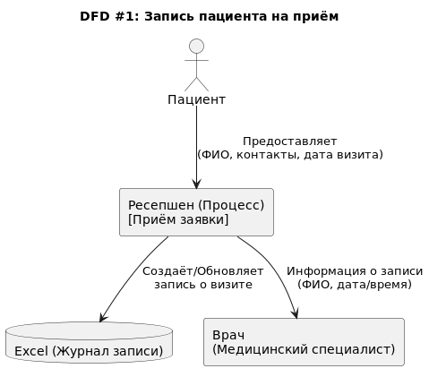

## Диаграммы потоков данных

### DFD #1: "Запись пациента на приём"

**Суть процесса**: пациент приходит на ресепшен (или звонит), чтобы записаться. Ресепшен регистрирует его в Excel (или
бумажном журнале), а также передаёт информацию врачу.

1. **Пациент** ― внешний субъект (actor).
2. **Ресепшен** ― процесс, который обрабатывает входные данные (personal data).
3. **Excel (Журнал записи)** ― хранилище данных (database).
4. **Врач** ― внутренняя сущность, которая получает расписание или информацию о грядущем визите (можно считать "
   процессом" или "участником" системы).

---

### DFD #2: "Ведение медицинской карты и учёт анализов"

**Суть процесса**: после записи к врачу, приём проходит, врач вносит данные о диагнозах, результатах осмотров в
медицинскую карту (часто в Excel, PDF или сканах). Результаты анализов (лаборатория) тоже прикрепляются вручную.

1. **Медицинская карта** может храниться в разных форматах (Excel, PDF, JPG), поэтому в диаграмме обозначено единое "
   хранилище" для упрощения.
2. **Лаборатория** ― внешняя система; взаимодействие пока реализуется вручную (сканы, PDF) либо потенциально через API (
   будущее улучшение).
3. **Объём конфиденциальных данных** (PII и медицинские данные) очень велик.

---

### DFD #3: "Приём платежей и учёт в бухгалтерии"

**Суть процесса**: кассиры принимают оплату (наличные, карты и т. д.), данные дублируются в Excel и в "1С Бухгалтерия
предприятия", а затем передаются в бухгалтерию для формирования отчётности.

1. **Кассир** получает от пациента конфиденциальную информацию о платеже.
2. В **Excel** ведётся дублирование учёта, что увеличивает риск рассинхронизации и несанкционированного доступа.
3. **1С Бухгалтерия** ― основная система для финансового и налогового учёта, но в файловом режиме.

---

### DFD #4: "Учёт ТМЦ и взаимодействие со складом"

**Суть процесса**: склад обрабатывает поступление товарно-материальных ценностей (ТМЦ) и передаёт информацию в "1С
Торговля и склад", которая синхронизируется с "1С Бухгалтерия предприятия".

1. **Данные о закупках** тоже потенциально конфиденциальны (условия контрактов, цены).
2. Интеграция 1С Торговля/Склад с 1С Бухгалтерия позволяет обмениваться данными, но при файловом режиме могут быть
   ограничения на разграничение доступа и аудит.