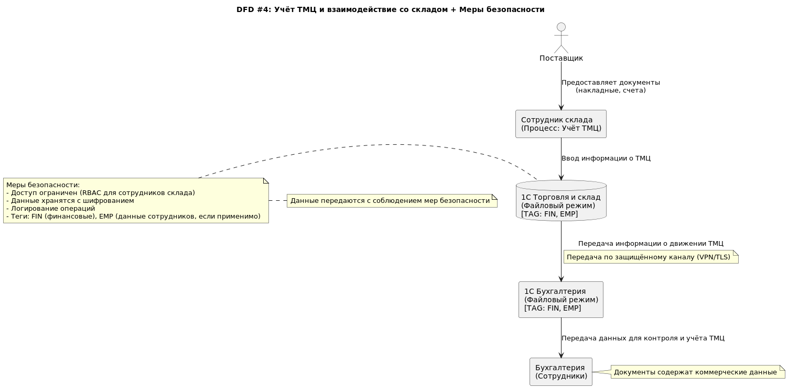

## Доработка DFD с учётом мер безопасности

### DFD #1: Запись пациента на приём

### DFD #2: Ведение медицинской карты и учёт анализов

### DFD #3: Приём платежей и учёт в бухгалтерии

### DFD #4: Учёт ТМЦ и взаимодействие со складом

