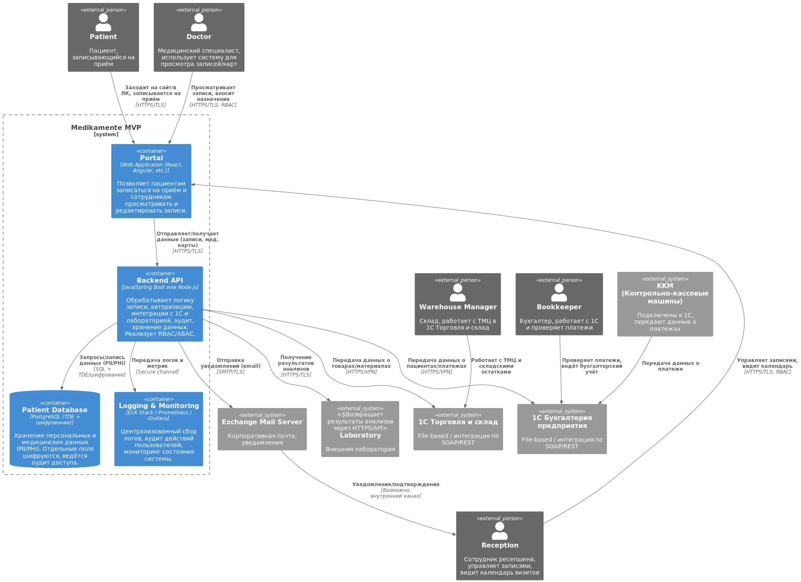

# Проектирование целевого решения (To-Be) для MVP

## 1. Рамки MVP

- **Функциональность для клиентов**:
    - Клиент должен иметь возможность самостоятельно записаться на приём через веб-портал или мобильное приложение. При
      этом личные данные, используемые при записи, обрабатываются с соблюдением мер безопасности (шифрование, аудит,
      разграничение доступа).
- **Функциональность для ресепшена**:
    - Сотрудники ресепшена должны видеть записи, управлять ими (подтверждать, редактировать, отправлять напоминания) с
      помощью защищённого интерфейса. При этом права доступа разграничиваются (RBAC/ABAC) – сотрудники видят только
      необходимые данные.
- **Напоминание о приёме**:
    - Система должна отправлять напоминания клиентам за день до приёма (через SMS, email или push-уведомления).
- **Интеграция с другими системами**:
    - Решение должно взаимодействовать с 1С для учёта платежей, лабораторией для получения результатов анализов и
      платёжным шлюзом для обработки транзакций. Все внешние вызовы осуществляются через защищённые каналы (HTTPS/TLS,
      VPN).

## 2. Диаграмма контейнеров (C4-модель)

1. **Portal** (новый компонент)
    - Заменяет старые Excel/"Journal/Doctor PO" для записи пациентов.
    - Пациенты и сотрудники (ресепшен/врачи) работают через единый интерфейс.
    - Данные передаются по HTTPS/TLS, а доступ контролируется ролями (RBAC).
2. **Backend API** (новый компонент)
    - Вся бизнес-логика: запись, редактирование, напоминания, авторизация/аутентификация, аудит.
    - Интеграции с 1С (бухгалтерия, склад), лабораторией (получение анализов) и Exchange Server (отправка
      писем/уведомлений).
    - Шифрует конфиденциальные поля (PHI/PII) и ведёт логи в Monitoring.
3. **Patient Database** (новая отдельная БД)
    - Вместо "Data #1" и разбросанных файлов используется централизованное хранилище (PostgreSQL или др.) с Transparent
      Data
      Encryption.
    - Конфиденциальные поля (мед. данные, персональные данные) дополнительно шифруются.
    - Логирование операций чтения/записи.
4. **Logging & Monitoring** (добавлен компонент)
    - Центральное место для сбора логов и метрик.
    - Позволяет отслеживать, кто, когда и какие данные просматривал или изменял (Data Lineage).
5. **1С** (Accounting / Trade & Warehouse), **KKM**, **Exchange** и **Laboratory**
    - Остались внешними системами.
    - Взаимодействие теперь проходит через защищённые каналы (HTTPS/TLS, VPN).
    - 1С в файловом режиме остаётся для бухгалтерии и склада, но обмен с MVP организован по API (SOAP/REST).

---

Таким образом, MVP позволяет обеспечить автоматическую запись клиентов на приём, удобное управление этими записями для
ресепшена и врачей, а также повысить уровень безопасности и соответствие принципам Privacy by Design, Data Minimization
и Data Lineage.

## 3. Описание механизмов безопасности

### Хранение конфиденциальных данных
- **База данных**:
  - Хранит записи о пациентах, медицинские карты, историю записей и логи операций.
  - Используется шифрование на уровне базы (TDE) и шифрование отдельных полей для особо чувствительных данных (PII, PHI).
  - Доступ к данным ограничен посредством RBAC, где права определяются на уровне ролей (например, врачи, ресепшен, IT-сотрудники).
- **API Бэкенд**:
  - Централизует бизнес-логику, обрабатывая запросы от портала и мобильного приложения.
  - Реализует аутентификацию и разграничение доступа (RBAC/ABAC), регистрируя каждое действие в системе логирования.
  - Обеспечивает безопасность при передаче данных между контейнерами через шифрованные каналы (HTTPS/TLS, VPN).

### Условия уничтожения или анонимизации
- **Политика хранения**:
  - Медицинские и персональные данные хранятся согласно регламенту: данные уничтожаются или анонимизируются по окончании срока хранения или по запросу клиента (например, удаление медицинских карт, если клиент отзывает согласие).
  - Механизмы анонимизации включают деперсонализацию данных в аналитических копиях, чтобы сохранить статистику без компрометации личной информации.

### Механизмы шифрования
- **На уровне взаимодействия**:
  - Вся передача данных между клиентами и сервером происходит через HTTPS/TLS.
  - Взаимодействие между внутренними контейнерами (например, API Бэкенд и интеграция с 1С, лабораторией или платёжным шлюзом) защищено VPN или зашифрованными соединениями.
- **На уровне хранения**:
  - База данных использует Transparent Data Encryption (TDE) для защиты данных "на диске".
  - Дополнительно, поля, содержащие PII или PHI, могут быть зашифрованы на уровне приложения или с помощью встроенных функций СУБД.

### Разграничение доступа (RBAC/ABAC)
- **Для клиентов**:
  - Доступ к личному кабинету (записи, результаты анализов) строго ограничен авторизацией, основанной на роли клиента.
- **Для сотрудников ресепшена**:
  - Интерфейс веб-портала обеспечивает просмотр и редактирование записей, но только в пределах их полномочий.
- **Для систем интеграции**:
  - Каждая интеграция (с 1С, лабораторией, платёжным шлюзом) настроена таким образом, чтобы обрабатывать только необходимые данные, а доступ к ним осуществляется по защищённым API с проверкой аутентификации.
- **Логирование и аудит**:
  - Все операции пользователей и сервисов регистрируются в системе мониторинга, что позволяет отслеживать несанкционированный доступ и быстро реагировать на инциденты.